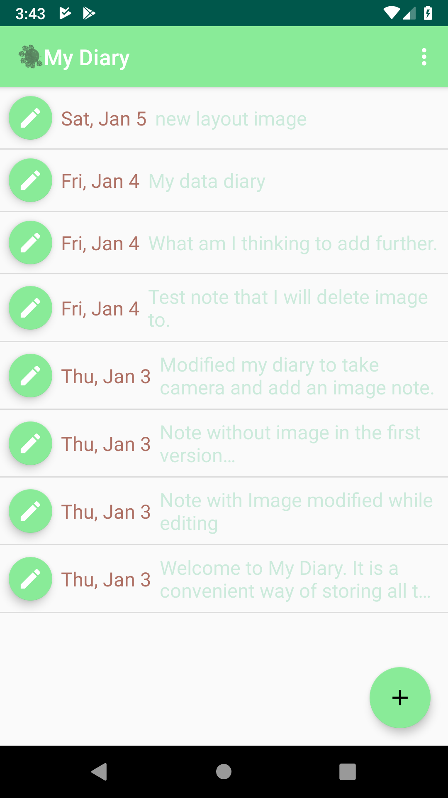

# MyDiary
**_MyDiary_** android application that allows users to take textual notes and attach image to these notes. It
uses SQLite to store the textual information and uses the local file sustem to store the private
image library.

At the moment in version v1.0 will only allow you to store information in the SQLite db which will be further
enhanced.

  

    
  

  

    
  

  

    
  

  

